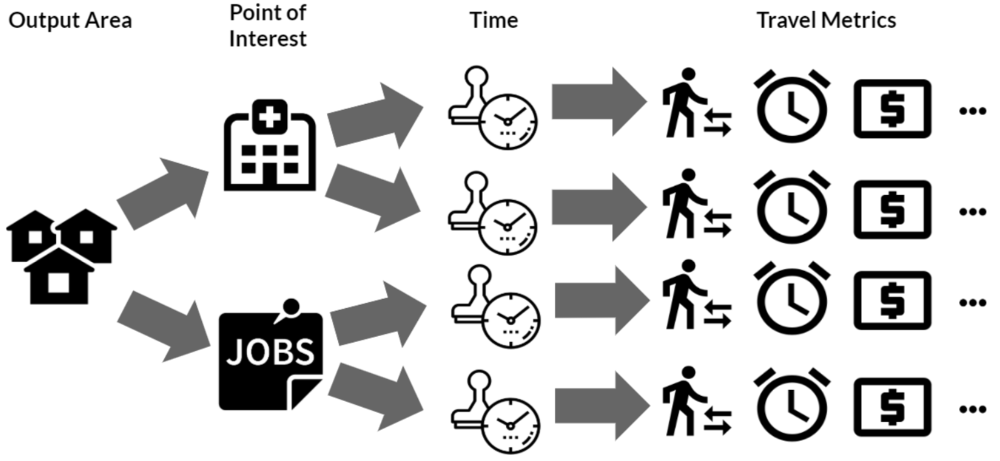
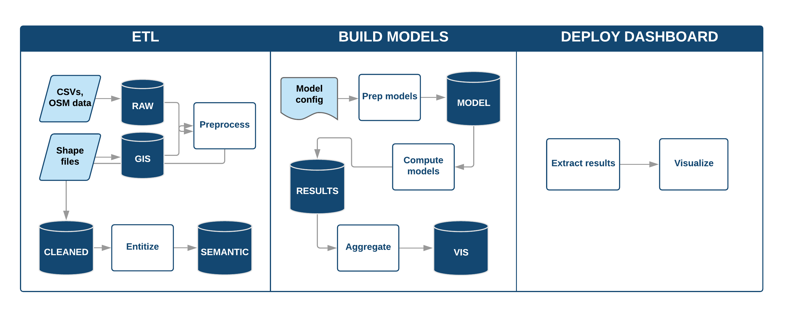
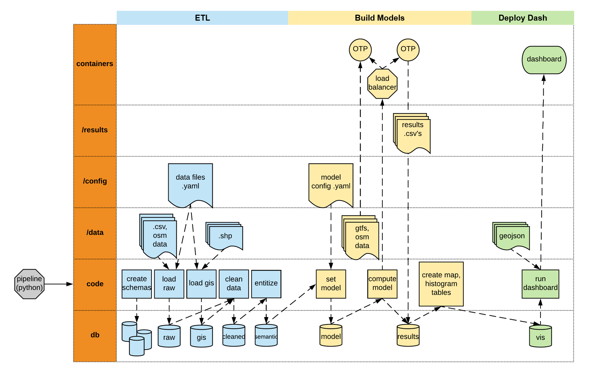

# Understanding and Reducing Inequities in Transportation in the West Midlands

This repo measures inequities in transit access across the West Midlands by deriving transit access metrics and combining them with demographic data. It then serves this information in a dashboard, enabling fine-grained analysis of which communities most require transit investment.

# Part I: Project Description

## The Policy Problem		
The West Midlands is the fastest-growing region of England outside of London, and one of its most ethnically diverse as well. One of the ways that the West Midlands Combined Authority wants to prepare for this growth is by expanding the public transportation system, but decisions must be made about where to focus investment. Policymakers in the West Midlands want to ensure that these decisions do not discriminate against any demographic groups, especially those who already face marginalization or deprivation.

Towards this end, planners need to answer questions about the ease with which specific demographic groups can access specific types of destinations by public transport, such as "In which places do immigrants lack transit access to their places of work?" Unfortunately, no out-of-the-box data product exists to give planners these insights.

## The Technical Problem

### Objective
Our objective is to build a data product that: 1) quantifies the access to public transport; and 2) showcases the inequities in access across different demographic groups. Every data source used in the project is public and in a form available in a wide range of municipalities around the world.

### Methodology

#### Compute informative metrics of access

This project quantifies transport access as the cost of a journey by public transit. This cost is dependent on the _origin_, _destination_ and _departure time_ of the journey, and composed of several dimensions such as _total journey time_, _walking distance_ in the journey (i.e. to bus stops), and _fare_. For a given neighbourhood (UK output area in our case), this tool calculates the collection of costs of all different journeys that depart from there (using its centroid as the proxy starting point). It samples a number of journeys for each user-specified type of point of interest (e.g., hospital, job centre) and time window (e.g., weekday morning peak), and computes the multiple dimensions of their costs, as illustrated below.

To compute the costs, we use [__OpenTripPlanner__](http://opentripplanner.org) (OTP), a widely used open-source application for transport analysis. Running on a Java server, this tool constructs multimodal networks of roads and transport routes connected by junctions and stops based on standard data input (see Technical Details below). It uses A* algorithm, which searches for the shortest path(s) in a graph, to find reasonable itineraries via the combination of transport and walking for the given journey.

#### Identify access inequities and opportunities for change

To unveil the inequities in transit access across neighbourhoods, this tool derives the overall access metric of each combination of (output area, point of interest, time window) by taking the **median** of costs across all journey sampled within each combination. In parallel, it calculates the population of different demographic groups across neighbourhoods. Putting these two layers together, we can identify "at-risk" neighbourhoods with a large population of certain disadvantage groups but poor access to certain points of interest, thus pointing to opportunities for change in transport services.

All these results are fed into an interactive web-based dashboard that allows the user to explore and compare access across regions and populations.

# Part II: Technical Details

## Prerequisites

- Docker (version 3.7+)
- A PostgreSQL database with extension PostGIS

## How it works
The pipeline of building and deploying the data product can be divided into three distinct processes:

1. **Extract-Transform-Load (ETL).** Upload, clean, and entitize data to a database for use in model computations. (source code in `/src/run_etl.py`)

2. **Build Models.** Compute access metrics and population counts, and store aggregated results ready for visualization back into the database. (source code in `/src/run_model.py`)

3. **Deploy Dashboard.** Extract visualization data from the database and launch a dashboard server, which can be accessed from a browser. (source code in `/src/run_dashboard.py`)

We use Docker, a tool which enables code to run in virtual environment-like containers, to package up the entire pipeline. This allows us to deliver a product with all dependencies and libraries already included, instead of requiring the user to separately install dependencies on their local machine. Using Docker-Compose also allows us to easily orchestrate the various technical dependencies of our tool. We further abstract Docker commands into a Bash script, `deploy.sh`, which allows the user to run the entire pipeline from beginning to end from a terminal window with the command:

	./deploy.sh deploy -mode replace

The diagram above gives a conceptual overview of the pipeline process. The one below provides a more detailed outline of how the code is structured; all source code is run from a "pipeline" container running Python.

## Getting started
Navigate to a directory where you want to host the project and then clone this repository by  running:

	git clone https://github.com/alan-turing-institute/DSSG19-WMCA.git

## Data requirements
This project requires that you have access to a PostgreSQL database with the PostGIS extension. Navigate into the project's home directory by running:

	cd DSSG19-WMCA.git

Now, you're ready to add the data to your repository. The source code assumes that all data input lives in the `/data` subfolder of the home directory, so the following sources (unless otherwise noted) should be downloaded into that folder.

### OpenTripPlanner
- The Dockerfile for the OpenTripPlanner containers that contains OpenTripPlanner directly downloads the required OTP `.jar` file from a URL, rather than searching for it in `/data`. You want the most recent one that ends in the suffix `shaded.jar`. Updates are posted to [this directory](https://repo1.maven.org/maven2/org/opentripplanner/otp/); during development we used [version 1.3.0](https://repo1.maven.org/maven2/org/opentripplanner/otp/1.3.0/otp-1.3.0-shaded.jar).

### General Transit Feed Specification
- GTFS is a standard for describing public transit routes and timetables developed by Google, and it comes in the form of a zipped directory of text files. You should be able to obtain a GTFS file from your local transit authority's website. During development, we used the file available from Transport for West Midland's API. To obtain these files, first visit TfWM's [sign-up page](https://api-portal.tfwm.org.uk/signup) to get an app id and an app key. Then use this query to get GTFS.

		http://api.tfwm.org.uk/gtfs/tfwm_gtfs.zip?app_id=[YOUR_APP_ID]&app_key=[YOUR_APP_KEY]

- Place the zipped directory in your `/data` folder. Note that OpenTripPlanner takes the **zipped directory** as an input. If you unzip it, you'll need to zip it back up before running OTP.

**Note on GTFS fare data**:
Depending on the practices of your local transport authority, you may or may not find a `fare_attributes.txt` file in your GTFS directory. In our case, WMCA did not offer a fares table, so we augmented the GTFS files with a simple one.

If your GTFS does not contain fare data (and you're not adding your own), then you'll want to edit `/config/base/model_config.yaml`. Find the `metrics` dictionary and comment out the `-fare` item. This will cause the OpenTripPlanner to run without writing fare costs to the database as `null`. 	

### OpenStreetMaps
- A number of sites host OpenStreetMaps files in the `.pbf` format that OpenTripPlanner requires. We recommend [GeoFabrik](http://download.geofabrik.de/) and, during development, we used [OpenStreetMaps files for the West Midlands available here](https://download.geofabrik.de/europe/great-britain/england/west-midlands.html).

- Place the `.pbf` file in your `/data` folder.

### Geojson file for mapping
- For mapping purposes, you'll need one geojson file that includes the names and polygons of the spatial units you're working with. Generally speaking, you'll want to choose the smallest spatial area for which demographic information is available in your country. In the U.K., this means Ouput Areas. In the U.S. this means Census Tracts. Because the West Midlands contains 8,463 output areas, we simplified the shapes using [MapShaper](https://mapshaper.org/). This file also needs to be placed in `/data`.

### Demographic & boundary data
- We downloaded .csv files from the [2011 Census](https://www.ons.gov.uk/census/2011census) with counts of demographic groups at the output area level into a subdirectory within the `/data` folder.
- We used a shapefile of West Midlands County with output area-level geometries.

### Point of interest data
- We downloaded and/or scraped data from various government websites on point-of-interest locations (latitudes and longitudes) and saved them into .csv files into a subdirectory within the `/data` folder.

## Setup

At this point, you've cloned the repository and uploaded your data into the `/data` subdirectory, and have verified that you've installed the tools needed under [Prerequisites](#prerequisites). The last step to complete before you can run the pipeline is to change user-specified local credentials and model parameters in the following 3 files.

### Environment File

This file contains local credentials. In the home directory, rename `.env_sample` to `.env` and change the following environment variables in `.env` to your local credentials:

- `ROOT_FOLDER`: The absolute path to your home directory (e.g. `/home/myuser/DSSG19-WMCA/`)
- `POSTGRES_*`: Your PostgreSQL database credentials. Note that `POSTGRES_HOST` is set to `outside`, which is set to the default Docker IP address in `docker-compose.yml`; don’t change this if running through Docker as intended.
- `MAPBOX_TOKEN`: Mapbox token for visualizing maps in the dashboard.

There's no need to change the `LOAD_BALANCER_*` variables or `NUM_OTPS`. Respectively, they specify how to connect to the Docker load-balancer container (which you would only need to change if you changed the Docker architecture) and how many OpenTripPlanner Java servers to use (which you might want to increase or decrease depending on the size of your RAM; leaving `NUM_OTPS=12` consumes 60 GB of RAM during the Build Models process. `NUM_OTPS` is only used in the source code to divide up the requests into that many chunks before passing to the load-balancer. You will also need to remove or add `otp` containers in the `docker-compose.yml` file if you want to launch a different number of servers.).

### Data Configuration

This file (`/config/base/data_files.yaml`) lists the data files that you want to upload to the database from `/data`.

- `text_dict` maps each .txt or .csv file to a table in the `raw` schema.
- `gis_dict` maps each .shp file to a table in the `gis` schema.
- `osm_file` gives the name of the OpenStreetMap .pbf file that is uploaded to the `raw` schema.

If you upload any new data sources to the `/data` folder, you also need to add the file (and map it to a corresponding table name, if applicable) to `/config/base/data_files.yaml` in order for these sources to be added to the database.

### Model Configuration

This file (`/config/base/model_config.yaml`) sets user-specified parameters for building models, including:

- `populations`:  demographic groups of interest, each being defined as the sum of certain columns in table `semantic.oa` (e.g., disabled = disability_severe + disability_moderate)
- `points_of_interest`: types of point of interest (e.g., hospital), as in the `type` column of table `semantic.poi`, along with the numbers of nearest instances to select if different from default
- `time_defs`: user’s definition of time elements (e.g., AM peak time as 6:30-8:30, weekday as Tuesday only, term duration as Oct 2017 to June 2018)
- `time_strata`: time segments of interest that are combinations of time elements (e.g., term time weekday AM peak), from which the tool will sample timepoints, along with the numbers of expected samples if different from default
- `metrics`: access metrics to include in the dashboard, as in the columns of table `results.trips`
- `hyper_params`: other hyperparameters including:
	- `n_timepoint`: default number of timepoints to sample in each time stratum
	- `k_POI`: default number of candidate instances to search over for the nearest point of interest

## Run the pipeline

Navigate to ROOT_FOLDER. `deploy.sh` is a Bash script which abstracts the process of running the pipeline with Docker. If this is your first time running the script, first give execute permission to the script:

	chmod +x ./deploy.sh

To run the entire pipeline and REPLACE all tables that currently exist, run

	./deploy.sh deploy -mode replace

To run the entire pipeline and APPEND to existing tables (i.e. if you are adding a new point of interest, but don't want to destroy prior queries,), run

	./deploy.sh deploy -mode append

The `-mode` flag is required.

What this does under the hood is:

1. `docker-compose up`: Starts the Docker infrastructure (launches containers for pipeline)
2. `docker-compose run pipeline -c "import run_etl; run_etl()"`: Runs the ETL process
3. `docker-compose run pipeline -c "import run_model; run_model()"`: Runs the Build Models process
4. `docker-compose run dashboard`: Runs the Deploy Dashboard process to launch a server at a specified address. The user can then access the dashboard by entering the address into their browser.
5. `docker-compose stop ...` & `docker-compose rm ...`: Stops and removes containers which are no longer needed after ETL and pipeline have finished, but leaves the dashboard server running.

Anyone who wants to access the dashboard can view it in a browser at the address returned. To stop the dashboard server, run `./deploy.sh stop`. Other helpful commands (including ones intended for use in development/debugging) can be found in the help manual by running `./deploy.sh help` or `./deploy.sh -h` in terminal.

Note that the dashboard currently runs on a Flask server, which is only intended for development, not production use.

## Issues and ways to pitch in
- __Develop a better way to snap outlier points to the network__. We currently assume that all the journeys from one output area start from its centroid, but in some cases this point might fall off the road network and OpenTripPlaner returns null values for such journeys. Our current solution is snapping such points to the nearest road, but still some of these roads do not connect with the bigger network. We end up manually correcting these locations, but a better way to address this issue is needed for scalability.
- __Deploy and host a dashboard__. The current dashboard code runs a development server locally, but for broader usage, we expect to see instances of the dashboard deployed publicly.  
- __Make findings more accurate in rural areas__. Modeling the location of an output area with a snapped centroid works OK in small output areas, but it is a less ideal solution in the large, rural ones. One potential solution is switching to the postcode level for OpenTripPlaner queries when the output area is large, but we ran out of time before implementing it.

## Extending the tool to other locations

We hope that planners and researchers will use our tool to measure disparities in access to transit in cities across the world. To that end, we've tried to make the software as portable as possible.

The near-universal availability of OpenStreetMaps, GTFS, and census data mean that this tool can work in cities from Buenos Aires, Argentina to Bucharest, Romania. As long as you have Open Street Maps (OSM), public transit data in the General Transit Feed Specification (GTFS) format, and some form of census data, you should be able to use our tool to investigate which groups lack access to transit in your town.

That being said, your location will affect the ease with which you can implement this project:

- __Users based in the UK__. You will need to download local OpenStreetMaps, GTFS, and census data, but the pipeline will run without requiring changes to the code.
- __Users based in other places where GTFS and OSM data__. You will be able to run the pipeline without substantial changes. Local census data will be formatted differently and will include different populations, and minor adjustments will be necessary to incorporate them into the analysis.

We encourage engaged citizens, journalists, and planners to run the tool in their town and publish their findings — or, even better, the interactive maps and scorecards themselves — making gaps in transit visible and adding new evidence to policy conversations.
